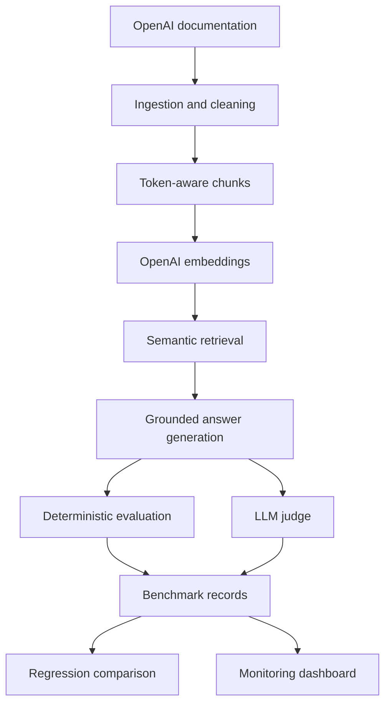
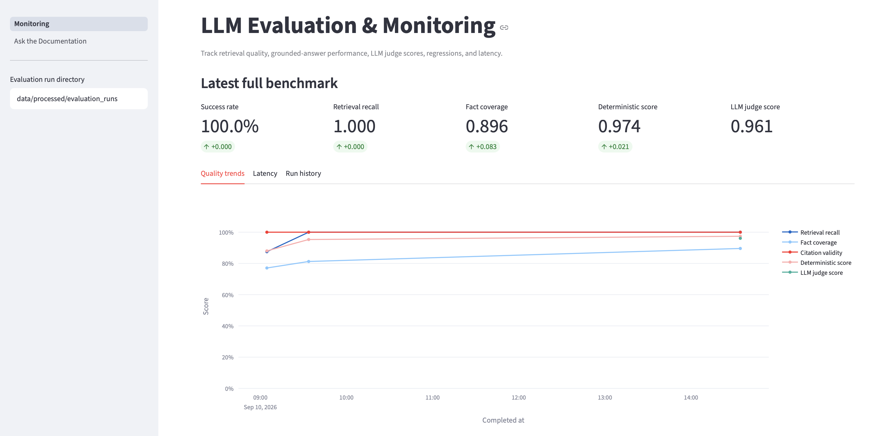
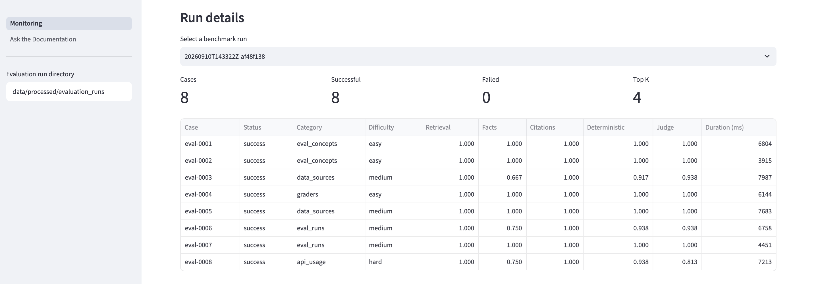
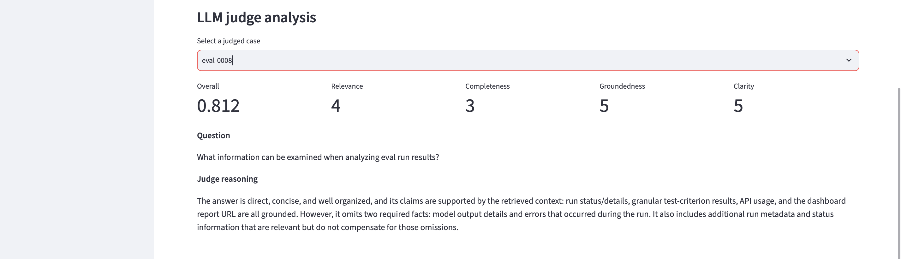
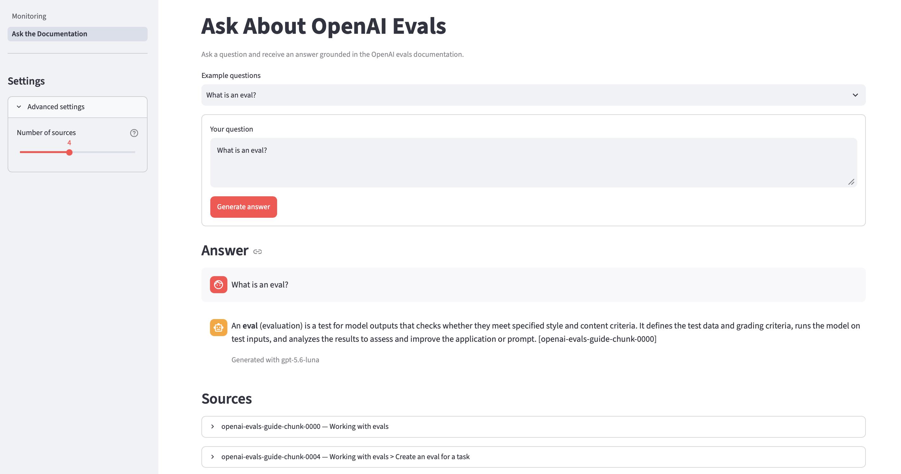

# LLM Evaluation & Monitoring Platform

[](https://github.com/fatemeh-Salmani1/llm-evaluation-monitoring-platform/actions/workflows/ci.yml)

A practical platform for testing, evaluating, and monitoring a retrieval-augmented LLM application.

The project ingests documentation, creates searchable embeddings, retrieves relevant context, generates grounded answers with citations, evaluates answer quality, detects regressions between benchmark runs, and presents the results in an interactive dashboard.

## Project overview

LLM applications can produce fluent answers that are incomplete, unsupported, or based on the wrong context. This project provides a repeatable workflow for measuring those problems instead of relying only on manual testing.

It supports:

- Document ingestion and processing
- Token-aware Markdown chunking
- OpenAI embedding generation
- Semantic retrieval
- Grounded answer generation
- Source-chunk citations
- Deterministic evaluation metrics
- LLM-as-a-judge evaluation
- Benchmark execution and result storage
- Regression detection and quality gates
- Interactive monitoring and question-answering interfaces

## Architecture



## Main capabilities

### Document ingestion

The ingestion workflow:

- Loads document source configuration
- Downloads Markdown documentation
- Rejects empty or unsuccessful responses
- Cleans the downloaded content
- Records source and processing metadata
- Calculates a SHA-256 checksum for data lineage

### Retrieval

The retrieval system:

- Splits Markdown using headings and token limits
- Preserves heading paths and source metadata
- Generates embeddings with `text-embedding-3-small`
- Stores embeddings in validated JSONL records
- Uses cosine similarity to rank relevant chunks
- Supports configurable top-k retrieval

The current document collection contains:

- 18 document chunks
- 18 unique embeddings
- 1,536 dimensions per embedding

### Grounded answer generation

Questions are answered using only the retrieved documentation.

The generation workflow:

1. Embeds the user’s question.
2. Retrieves the most relevant chunks.
3. Supplies those chunks to the generation model.
4. Instructs the model not to use outside knowledge.
5. Returns a concise answer with source-chunk citations.

If the retrieved documentation does not contain an answer, the assistant is instructed to say that the available context is insufficient.

### Evaluation

The benchmark contains eight questions covering:

- Evaluation concepts
- Data-source configuration
- Test-data uploads
- Graders
- Evaluation runs
- Result analysis
- API usage

Each generated answer is evaluated with deterministic metrics and, optionally, an LLM judge.

#### Deterministic metrics

| Metric | Purpose |
|---|---|
| Retrieval recall | Measures whether expected source chunks were retrieved |
| Fact coverage | Measures how many required facts appear in the answer |
| Citation validity | Checks whether citations refer to retrieved chunks |
| Overall score | Combines retrieval, factual coverage, and citation quality |

#### LLM-as-a-judge

The optional LLM judge evaluates:

- Relevance
- Completeness
- Groundedness
- Clarity

Each dimension is scored from 1 to 5. The result also includes a normalized overall score and a written explanation.

The LLM judge complements the deterministic checks. For example, it identified an answer that was well grounded but omitted model-output details and errors when describing evaluation results.

### Regression monitoring

Benchmark summaries can be compared to identify changes in:

- Success rate
- Retrieval recall
- Fact coverage
- Citation validity
- Deterministic score
- LLM judge score
- Average response duration

Configurable quality thresholds determine whether a comparison passes or fails. This makes the comparison command suitable for automated release checks and CI workflows.

## Results

A full benchmark run with deterministic and LLM-judge evaluation produced:

| Metric | Result |
|---|---:|
| Successful cases | 8 / 8 |
| Success rate | 100.00% |
| Retrieval recall | 1.0000 |
| Fact coverage | 0.8958 |
| Citation validity | 1.0000 |
| Deterministic score | 0.9740 |
| LLM judge score | 0.9609 |
| Average duration | 6,369 ms |

An earlier retrieval configuration achieved a recall of `0.8750`. After increasing the retrieval depth and improving source selection, recall reached `1.0000`.

The regression comparison also recorded:

- Retrieval recall improvement: `+0.1250`
- Fact coverage improvement: `+0.0417`
- Overall score improvement: `+0.0729`
- Average latency improvement: `-730.34 ms`

Because model responses can vary, results from future live runs may differ slightly.

## Monitoring dashboard

The Streamlit dashboard tracks benchmark quality and performance over time.

It includes:

- Latest full-benchmark metrics
- Quality trends
- Latency trends
- Run history
- Case-level results
- LLM-judge dimensions
- Judge explanations



### Case-level benchmark results

Individual cases can be inspected to compare retrieval, fact coverage, citation quality, deterministic scores, LLM-judge scores, and latency.



### LLM-judge analysis

The judge view explains why an answer received its score and highlights missing information that deterministic checks may not fully capture.



## Documentation assistant

The browser-based assistant provides a simple interface for asking questions about the ingested documentation.

It displays:

- The generated answer
- Source-chunk citations
- The generation model
- Retrieved source content
- A configurable number of sources



## Technology stack

- Python 3.12
- OpenAI API
- Pydantic
- Pydantic Settings
- tiktoken
- HTTPX
- pandas
- Plotly
- Streamlit
- pytest
- Ruff
- uv
- GitHub Actions

## Project structure

```text
.
├── .github/
│   └── workflows/
│       └── ci.yml
├── dashboards/
│   ├── pages/
│   │   └── 1_Ask_the_Documentation.py
│   ├── Monitoring.py
│   └── *.png
├── data/
│   ├── benchmarks/
│   │   └── openai_evals.jsonl
│   ├── processed/
│   ├── raw/
│   └── sources/
│       └── openai_docs.json
├── src/
│   ├── config/
│   ├── evaluation/
│   ├── generation/
│   ├── ingestion/
│   ├── monitoring/
│   └── retrieval/
├── tests/
├── .env.example
├── pyproject.toml
└── uv.lock
```

Generated raw documents, embeddings, and evaluation-run records are excluded from Git because they can be recreated by the pipeline.

## Installation

### Prerequisites

You need:

- Python 3.12 or later
- [uv](https://docs.astral.sh/uv/)
- An OpenAI API key with available API credits

### Clone the repository

```bash
git clone https://github.com/fatemeh-Salmani1/llm-evaluation-monitoring-platform.git
cd llm-evaluation-monitoring-platform
```

### Install dependencies

```bash
uv sync
```

### Configure the environment

Create a local environment file:

```bash
cp .env.example .env
```

Add your API key to `.env`:

```dotenv
ENVIRONMENT=development
LOG_LEVEL=INFO
OPENAI_API_KEY=your-openai-api-key
```

The `.env` file is ignored by Git and must never be committed.

## Running the pipeline

### 1. Ingest the documentation

```bash
uv run python -m src.ingestion.run
```

This downloads, validates, cleans, and stores the configured documentation.

### 2. Generate document embeddings

```bash
uv run python -m src.retrieval.run_embeddings
```

This creates embeddings for the processed chunks and stores them locally.

### 3. Test semantic retrieval

```bash
uv run python -m src.retrieval.run_retrieval \
  "What are evaluations used for?" \
  --top-k 4
```

### 4. Generate a grounded answer

```bash
uv run python -m src.generation.run_answer \
  "What is an eval?" \
  --top-k 4
```

## Running evaluations

### Deterministic benchmark

```bash
uv run python -m src.evaluation.run_benchmark
```

### Benchmark with LLM judge

```bash
uv run python -m src.evaluation.run_benchmark \
  --enable-llm-judge
```

For a lower-cost test run:

```bash
uv run python -m src.evaluation.run_benchmark \
  --limit 1 \
  --enable-llm-judge
```

Each run creates:

- A JSONL file containing case-level results
- A JSON summary containing aggregate metrics

The files are written to:

```text
data/processed/evaluation_runs/
```

## Comparing benchmark runs

Compare two summary files:

```bash
uv run python -m src.monitoring.run_comparison \
  data/processed/evaluation_runs/BASELINE.summary.json \
  data/processed/evaluation_runs/CURRENT.summary.json
```

Replace `BASELINE` and `CURRENT` with the relevant run identifiers.

The command displays metric changes, improvements, regressions, and the final quality-gate result.

## Running the web application

Start Streamlit from the project root:

```bash
PYTHONPATH="$(pwd)" uv run python -m streamlit run \
  dashboards/Monitoring.py
```

Then open:

```text
http://localhost:8501
```

Use the sidebar to switch between:

- **Monitoring** — evaluation results and trends
- **Ask the Documentation** — grounded question answering

## Testing and code quality

Run the complete test suite:

```bash
uv run python -m pytest -q
```

Run the linter:

```bash
uv run ruff check .
```

The project currently contains 144 passing tests covering ingestion, validation, chunking, embedding storage, semantic search, grounded generation, evaluation, LLM judging, regression monitoring, CLI behavior, and dashboard data preparation.

## Continuous integration

GitHub Actions runs the quality checks automatically for repository changes.

The workflow:

1. Checks out the repository.
2. Installs Python and uv.
3. Synchronizes locked dependencies.
4. Runs Ruff.
5. Runs the complete pytest suite.

The workflow configuration is stored in `.github/workflows/ci.yml`.

## Design decisions

### JSONL storage

JSONL keeps intermediate artifacts readable and easy to inspect while avoiding the additional infrastructure required by a vector database for this project’s current scale.

### Separate deterministic and LLM-based evaluation

Deterministic metrics are fast, reproducible, and easy to debug. The LLM judge captures semantic completeness and answer quality that exact matching may miss. Keeping both provides a more balanced evaluation.

### Source-level traceability

Every answer retains the IDs of its retrieved chunks. This makes it possible to verify citations and trace an answer back through retrieval, chunking, and the original document.

### Reproducible benchmark runs

Each benchmark execution receives a unique run ID and produces immutable case-level and summary records. Runs can therefore be inspected and compared without overwriting previous results.

## Current limitations

- The current knowledge base contains one OpenAI documentation guide.
- Embeddings are stored locally rather than in a production vector database.
- Deterministic fact matching uses configurable textual matching rules.
- Live evaluations require API credits.
- The Streamlit interface is intended for local demonstration rather than authenticated production deployment.

## Possible extensions

- Add more documentation sources
- Store embeddings in a vector database
- Add hybrid keyword and semantic retrieval
- Track token usage and API cost
- Add prompt and model version tracking
- Schedule benchmark runs
- Persist metrics in a database
- Add alerting for failed quality gates
- Deploy the dashboard as a hosted application

## Author

**Fatemeh Salmani**

Data Engineer with experience in data science, analytics, machine learning, NLP, cloud data platforms, and LLM applications.

- [GitHub](https://github.com/fatemeh-Salmani1)
- [Portfolio](https://fatemehsalmani.com)
